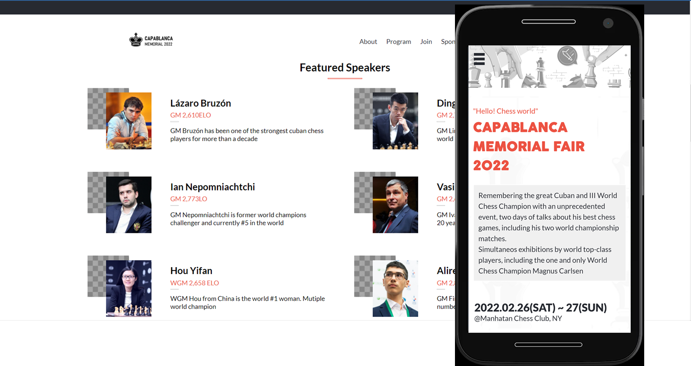
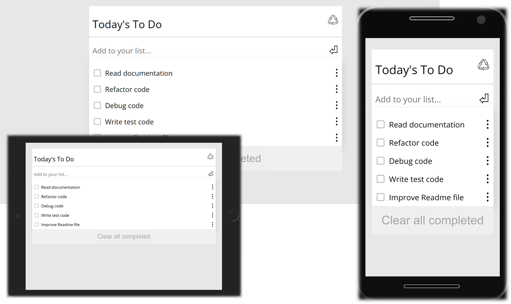
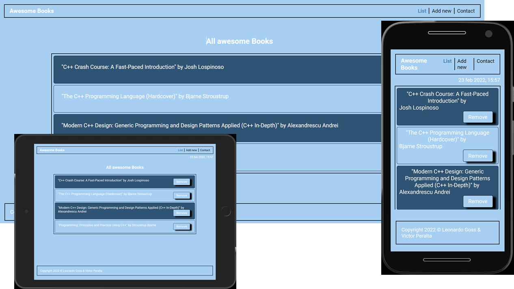

<h1> My Web projects portfolio</h1>

Hello, welcome to my Web Projects Portfolio  
Here you will find some of my works

 
<h1>Capablanca Memorial</h1>
A site about a Chess event of one of the greatest chess players of all time.

[Source Code](https://github.com/VicPeralta/capstoneHTMLJS)   

[Live demo](https://vicperalta.github.io/capstoneHTMLJS/)

 
<h1>ToDo List</h1>
A simple but handy utility program that allows you to keep your pending tasks at hand.    

You can rearrange the task order.

[Source Code](https://github.com/VicPeralta/to-Do-List)   

[Live demo](https://vicperalta.github.io/to-Do-List/)

 
<h1>Awesome Books</h1>
A simple but handy utility program that allows you to keep your book list tasks at hand.   

You can rearrange the order of the books.

[Source Code](https://github.com/VicPeralta/Awesome_Books_ES6)   

[Live demo](https://vicperalta.github.io/Awesome_Books_ES6/)

